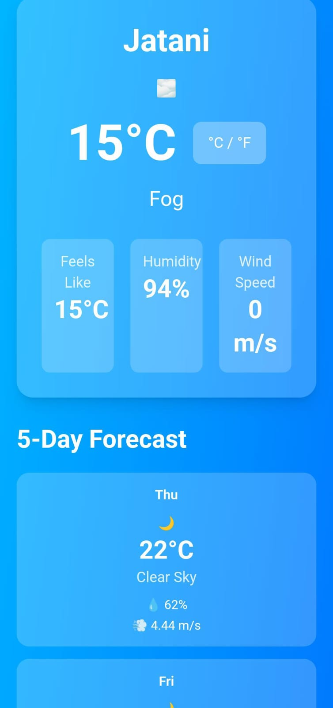

🌤️ Weather Forecast Application
--------------------------------

🔗Git Hub Link of this Project :-
----------------------------------

[This is the Git Hub link of this Project](https://github.com/Avisek14/weather-forecast-web)

📌 Live Project Link:
---------------------

[This is the Live Project Link](https://avisek14.github.io/weather-forecast-web/)

A modern, responsive weather forecast application built with JavaScript, HTML, and Tailwind CSS. Get real-time weather data and 5-day forecasts for any city or your current location.

✨ Features
Core Functionality
City Search: Search weather by city name with instant results
Current Location: Get weather data for your current GPS location
5-Day Forecast: Extended weather predictions with detailed information
Recent Searches: Dropdown menu of recently searched cities (stored locally)
Temperature Toggle: Switch between Celsius and Fahrenheit
Weather Alerts: Custom alerts for extreme temperatures (>40°C or <0°C)
Dynamic Backgrounds: Background changes based on weather conditions (sunny, rainy, cloudy, etc.)

👤User Experience
Smooth animations and transitions
Custom error popups (no browser alerts)
Loading indicators
Fully responsive design (Desktop, iPad Mini, iPhone SE)
Input validation with helpful error messages
Keyboard support (Enter key to search)

🚀 Technologies Used
HTML5: Semantic markup
CSS3: Custom animations and responsive design
Tailwind CSS v4: Utility-first styling
JavaScript (ES6+): Async/await, LocalStorage, Geolocation API
OpenWeatherMap API: Real-time weather data

📦 Installation & Setup
Prerequisites

Node.js (v14 or higher)
npm or yarn
OpenWeatherMap API key (free account at openweather map.org)

📁 Project Structure

weather-forecast-app/
│
├── src/
│   ├── script.js        # All JavaScript logic (API, DOM, events)
│   ├── style.css        # Tailwind generated CSS (final output)
│   ├── custom.css       # Custom animations, hover, responsiveness
│   └── input.css        # Tailwind input file (build purpose)
│
├── images/
│   ├── desktop/         # Desktop view screenshots
│   │   ├── home-desktop.png
│   │   ├── search-desktop.png
│   │   ├── forecast-desktop.png
│   │   └── extreme-temperature-desktop.png      #  Extreme temperature view
│   │
│   └── mobile/          # Mobile view screenshots
│       ├── home-mobile.png
│       ├── search-mobile.png
│       ├── forecast-mobile.png
│       └── extreme-temperature-mobile.png       # Extreme temperature view
│
├── index.html           # Main HTML entry point
├── README.md            # Project description & usage
├── package.json         # Project config & dependencies
├── package-lock.json    # Dependency lock file
├── .gitignore           # Ignore node_modules, env files
└── .hintrc              # (Optional) Code quality / lint config

🎨 Features Breakdown

🔍Search Functionality:-

Type a city name and press Enter or click Search
Validates empty inputs
Displays custom error for invalid city names

📍Current Location:-

Click "Use Current Location" button
Grants permission to access location
Fetches weather based on GPS coordinates

🏙️Recent Cities Dropdown:-

Automatically saves last 5 searched cities
Stored in browser's LocalStorage
Click any city to reload its weather

🌡️Temperature Toggle:-

Click °C/°F button to switch units
Only applies to current day's temperature
Smooth transition animation

😎Dynamic Backgrounds:-

Weather conditions change the entire page background:

☀️ Clear: Yellow to Orange gradient
☁️ Cloudy: Gray gradient
🌧️ Rainy: Dark slate with blue tones
❄️ Snowy: Light blue gradient
⛈️ Thunderstorm: Dark purple/black gradient

🌦️Weather Alerts
Automatic alerts for extreme conditions:

🔥 Temperature above 40°C: Heat warning
❄️ Temperature below 0°C: Freezing warning

🎯 API Usage
This app uses the OpenWeatherMap API with two endpoints:

1. Current Weather

GET https://api.openweathermap.org/data/2.5/weather

2. 5-Day Forecast

GET https://api.openweathermap.org/data/2.5/forecast

Both use metric units (Celsius, meters/second for wind).

📱 Responsive Design
Tested and optimized for:

✅ Desktop (1920x1080 and above)
✅ iPad Mini (768x1024)
✅ iPhone SE (375x667)
✅ All screen sizes in between

🐛 Error Handling
Invalid city names show user-friendly error popup
Network errors are caught and displayed
Geolocation errors handled gracefully
Empty search inputs prevented with validation

💾 Local Storage
The app stores:

Last 5 searched cities
Persists across browser sessions
Can be cleared via browser setting

🚫 Known Limitations
Requires active internet connection
Free API has rate limits (60 calls/minute)
Geolocation requires HTTPS or localhost

🔐 API Key Note

This project uses the OpenWeatherMap API.
Since this is a frontend-only application deployed on GitHub Pages,
the API key is visible in the client-side JavaScript.

For production use, the API key should be secured using a backend server
or environment variables with server-side rendering.

The key used here is restricted and intended only for educational purposes.

🌍 Live Deployment
This project can be deployed easily using GitHub Pages.

Steps:
1. Push project to GitHub repository
2. Go to Repository → Settings → Pages
3. Select branch: `main`
4. Set folder: `/root`
5. Save & access live URL

📝 License
This project is open source and available for educational purposes.

👨‍💻 Author

Avisek Sahoo  
JavaScript & Frontend Developer  
Weather Forecast App – Academic Project

🙏 Acknowledgments
Weather data provided by OpenWeatherMap API
Icons from OpenWeatherMap
Tailwind CSS for styling utilities

🖼️ Screenshots

Desktop View :-
---------------

mobile View :-
--------------

